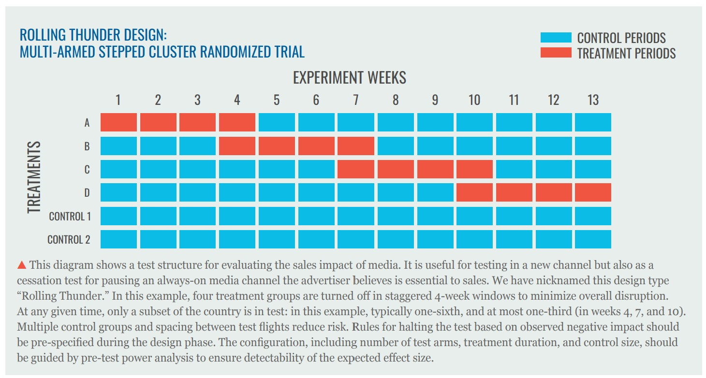
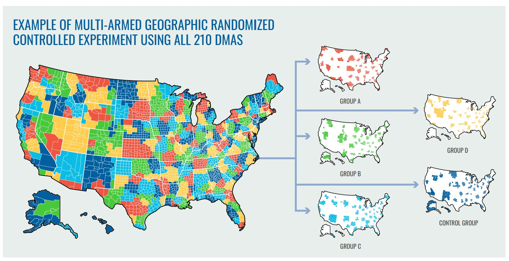
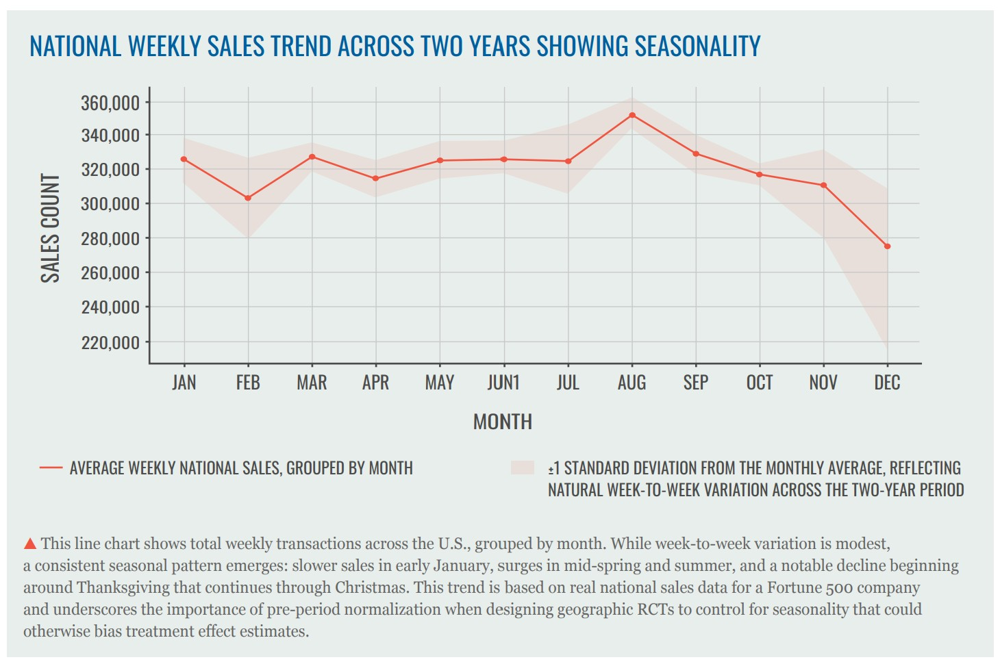

# Geographic Randomized Controlled Trials (Geo RCTs)

This repository provides open-source best practices for for conducting geographic randomized controlled trials (Geo RCTs) for measuring incremental sales effect of advertising cammpaigns. It includes details on one design type in particular, a **multi-armed stepped experimental design** that has particular advantages in terms of statistical strength and balance in using geographic regions, namely designated market areas (DMAs), as units of the experiment. It also covers other techniques for achieving statistical strength and balance with simpler experimental designs, including two-celled tests (test and control), including stratefied randomization, matched-pair randomization, covariate-constrained randomization and more.

These approaches ars designed to help advertisers, agencies, and researchers measure the causal impact of advertising across large geographic regions with improved statistical power and transparency.

The goal of publishing this methodology openly is to make it easier for practitioners to understand, evaluate, and apply Geo RCTs in their own work. The repository includes:
- A detailed write-up of the methodology (`README.md`)
- Code examples (`/code/`) for running simulations and analyses
- Supporting tables and reference materials (`/tables/`)
- A PDF version of the original whitepaper (`/Central_Control_Geo_RCT_Whitepaper.pdf`)

We welcome feedback, discussion, and contributions from the measurement community.

## CONTENTS

- INTRODUCTION
- FIRST STEPS
- SELECT DESIGN TYPE
- DESIGN THE EXPERIMENT
- CONDUCT POWER ANALYSIS
- LOCK THE DESIGN FRAMEWORK
- EXECUTE THE EXPERIMENT
- CONDUCT ANALYSIS
- INTERPRET AND ACT
- COMMON PITFALLS AND HOW TO AVOID THEM
- CONCLUSION
- APPENDICES
- ABOUT CENTRAL CONTROL

## INTRODUCTION

Incremental return on ad spend (iROAS) by using large-scale geographic randomized controlled trials (RCT). This document provides a detailed explanation of how to design and execute such experiments.

### EXPERIMENT PROCESS WORKFLOW

**EXPERIMENT DESIGN → STATISTICAL PRE-TESTING → DESIGN DOCUMENTATION → EXPERIMENT EXECUTION → ANALYSIS & REPORTING → BENCHMARKS & META-ANALYSIS**

DESIGN EXPERIMENTS TO ANSWER SPECIFIC QUESTIONS. PICK THE AMONG MULTIPLE TEST DESIGNS TO BEST SUIT REQUIREMENTS. → CONDUCT POWER ANALYSIS TO PRE-TEST DESIGN'S STATISTICS AND FIX ON PARAMETER VARIABLES. → PRODUCE AND SHARE EXPERIMENT DESIGN DOCUMENT WITH KEY STAKEHOLDERS. → MANAGE AND MONITOR EACH STAGE OF THE EXPERIMENTS. → UNDERSTAND TEST RESULTS CLEARLY, TAKE ACTION ON BUSINESS DECISION. → ANALYZE A LARGE BODY OF RCT RESULTS ACROSS CAMPAIGNS FOR BEST EVIDENCE OF WHAT DRIVES OUTCOMES.

The workflow above summarizes the end-to-end process for running advertising experiments. The final stage — benchmarking — compiles results from all experiments into a growing evidence base. As advertisers, agencies, and media companies accumulate dozens, then hundreds, or even thousands of tests, these benchmarks become a powerful source of insight. They reveal what truly works in advertising and provide expected effect sizes by media channel, ad format, partner, product category, and other key dimensions.

## FIRST STEPS

Before designing the experiment, several foundational questions should be addressed.

### DETERMINE THE RESEARCH QUESTION

**STATE YOUR BUSINESS OBJECTIVE AND THE DECISION TO BE SUPPORTED**

Experiments are not as difficult or expensive as many marketers perceive or portray them, but they do require resources and calendar time, so run them only when the answer will drive a meaningful business decision. Geo experiments are almost always "intent to treat" (ITT) designs, where treatment is tracked at the geographic level rather than the individual level. You know which geographic populations were intended to receive treatment, not which individuals actually saw the ads. This means your media investment must be substantial enough to detectably move KPIs at the geographic level. This technique isn't suited for relatively small campaigns or very rare conversions.

Start by measuring sales effects for your largest media channels to validate and calibrate coefficient assumptions in your marketing mix model. From there, having laid a baseline of channel-level validation and gotten a grounding in best practices for conducting experiments, researchers can branch out into nuances of the mix, such as the effectiveness of particular media partners, subchannel tactics, media formats and so forth.

Most importantly, identify the specific business decision that will be made based on the results, with marketing, analytics and finance working in concert. A well-constructed geo experiment that doesn't inform action is a waste of resources.

**Example business objectives:**

- Validate that the impact of a marketing channel, such as Search (or Television, Social, Retail Media, etc.) matches our marketing mix model's (MMM) coefficients, and if not, investigate (and experiment) further with a view to calibrate the MMM accordingly and reevaluate investment levels
- Measure iROAS of a media partner, such as Meta (or Google, Spotify, Disney, etc.) as a channel partner and renegotiate or reallocate if results are unfavorable
- Evaluate iROAS of a tactic, such as Retargeting (or Lookalike Targeting, Branded Search Keywords, Geo-fencing, etc.) and adjust investment accordingly

### DEFINE KEY EXPERIMENT VARIABLES

Next, we define the key parameters that will structure the experiment.

**INDEPENDENT VARIABLE: THE MEDIA INVESTMENT**

In an experiment, the independent variable is what you modify between test and control groups to measure its effect on the outcome variable. For advertising experiments, this means the ad campaign or media channel being tested, whether branded search, social media, television, or another tactic.

Since we're designing geographic experiments, it's crucial to verify that your chosen medium can reliably target different geographic units sufficiently for your testing objectives. This capability varies significantly across media types and platforms. Examples, as of this writing: Linear TV can be tested effectively using DMA targeting through providers like Ampersand or Nexstar, but individual networks like CBS or AMC may lack sufficient scale or targeting granularity. Spotify enables geo-targeting for streaming music and run-of-network podcasts but not for host-read spots on specific shows. Amazon supports geo-targeting for display and video on-site and their DSP but not for sponsored product keywords that comprise most retail media budgets. ZIP codes are not a reliably accurate testing unit for most media.

**DEPENDENT VARIABLE: KEY PERFORMANCE INDICATOR (KPI)**

The dependent variable is the outcome you're measuring, ideally sales. The fundamental assumption is that this outcome is influenced by the independent variable: running advertising increases sales. The experiment aims to quantify this causal relationship by comparing against the counterfactual baseline sales rate in the control group absent the advertising stimulus.

Sales is the preferred KPI as it directly measures iROAS, customer acquisition cost (CAC), and cost per acquisition (CPA), all metrics that should reflect true incrementality. Other outcomes such as foot traffic, search activity, web visitation, and brand lift can also be measured, but should be measured with RCT to know if the ads are having a true causal effect.

Critically, ensure you have reliable KPI data that aligns with the experimental structure. For geographic experiments, postal codes in customer databases are ideal — no device graphs, tracking pixels, or clean rooms required. Whether from first-party CRM systems or partner panels, ZIP codes easily roll up to most standard geographic units, allowing straightforward determination of whether each customer belonged to test or control groups at the time of conversion. That doesn't work with non-standard geographic units such as lat/long radial or hexagonal zones. 

**EXPERIMENT UNIT: GEOGRAPHIC REGIONS**

In RCTs, "experiment units" are the smallest entities to which treatment is independently applied and which are subject to randomization. For advertising, these could be individuals, devices, households, or geographic regions.

As explained in Central Control's article "Advertisers seeking accurate ROAS should use large-scale, randomized geo tests," user- and household-level targeting provides false precision. User-level tracking accuracy has generally been overstated by vendors, and Apple's App Tracking Transparency (ATT) and Safari browser have further degraded online tracking capabilities.

The internet's promise of 1:1 targeting was never fully realized. Cookies are inherently unstable, regularly deleted and lacking persistent identity. Industry responded with complex identity graphs and clean rooms. Users pushed back with ad blockers, while governments enacted privacy laws such as GDPR. As a result, when marketers attempt to match campaign-exposed audiences to first-party outcome data, match rates typically range from 50-60% or less.

Even at 80%, this introduces too much noise to reliably detect typical advertising effects of 1-5% with statistical confidence.

This explains the rise of geographic experiments. Using geo regions as experimental units forms what's known as cluster-randomized trials (CRT), where geographic clusters of individuals are randomly assigned to treatment conditions.

Geographic experiments offer multiple advantages. They sidestep privacy concerns by eliminating the need for personally identifiable information. Sales and other KPIs align naturally with this structure through ZIP-coded transaction data from CRM systems, without privacy implications or technical overhead.

Most media can accurately target large geographic regions, notably Nielsen's designated market areas (DMAs). While postal codes, cable zones, core based statistical areas (CBSAs), and states are alternatives, each presents challenges. Postal codes would be ideal, but, as discussed in the AdExchanger article "ZIP Codes: The Simple Fix For Advertising ROI Measurement," media companies currently infer ZIPs from IP addresses with high error rates or accumulate multiple ZIPs per user account, making them unreliable for experimentation without additional system enhancements.

Geographic regions suitable for experimentation must be mutually exclusive and sufficiently isolated to minimize spillover between test and control groups, upholding the experimentation best practice known as Stable Unit Treatment Value Assumption (SUTVA). Ideally, units should also be collectively exhaustive (MECE: mutually exclusive and collectively exhaustive).

DMAs meet these criteria well. They're mutually exclusive and collectively exhaustive across the US. Most people don't commute between DMAs — while NYC and Philadelphia DMAs border each other, their populations generally live and work within one or the other. With 210 US DMAs, randomization (as discussed further below) can balance the many factors affecting regional sales: income levels, education, competitive mixes, weather, and more. Critically, many media types can be targeted reliably by DMA in the US, a practice established since the 1950s.

Outside the US, metro areas or postal-code clusters typically work best for the same purpose of geo experiments.

Bear in mind, we're talking here about the RCT subclass of cluster randomized trials, so don't confuse this approach with matched-market tests (MMT) or synthetic control method (SCM). Those are forms of quasi-experiments, a scientific designation that means "not as good as real experiments," defined by a lack of randomization of assignments of test and control arms. This paper focuses on how to conduct geo RCTs for iROAS measurement and doesn't get into why CRT provides categorically better evidence than MMT or SCM. For more on that discussion, refer to articles including "Advertisers Seeking Cccurate ROAS Should Use Large-Scale, Randomized Geo Tests," "Recession-Proofing Your Ad Mix: Measure Twice, Cut Once" and "Gain Market Share by Disrupting Bad Ad Measurement" on Central Control's blog or LinkedIn page.

For this document, we focus on large-scale randomized geographic experiments using U.S. DMAs as the experimental unit, though these techniques can also be applied in other countries by targeting metro areas or postal code clusters.

## SELECT DESIGN TYPE

There are myriad types of designs for running experiments. We have already narrowed to some key parameters, such as that we are focusing on using geographic regions for the experiment units and also that we are using an intent-to-treat (ITT) design, meaning that we do not need to track who in the test group was actually treated with the campaign exposure, and that treatment is withheld from everyone in the control group. We will briefly discuss here a few other more design details, but settle on one for the rest of this paper.

Different business questions give rise to different experimental design choices.

Those include:

- ** Multi-armed, stepped CRT:** This design, nicknamed "Rolling Thunder," offers greater statistical power than a traditional two-celled test by generating many independent contrasts across time and treatment arms. Each group enters treatment in a staggered sequence and remains in for a fixed duration, creating repeated observations both within and across DMAs. This structure increases the precision of the causal estimate while reducing sensitivity to outliers or time-based shocks. The design is  well-suited for cessation testing: by phasing off the media gradually, advertisers can closely monitor sales impact, minimize the risk of revenue loss, and halt the test early if needed. It is just as applicable for introduction testing.



- **Targeting Test:** To see if the iROAS of a targeting technique pays off, this three-armed design includes one test group for targeting, one test group for minimally targeted media using the same creative, and one unexposed control group.

- **Media Bake-Off Trial:** When comparing two media channels against one another for the superior ROI, a three-armed test, one for medium A, one for medium B and a control group.

- **Media Bake-Off Plus Interaction Effect:** A four-armed test compares iROAS of two media properties plus their interaction effect, with one exposed to medium A, one medium B, one both, and one unexposed control group, using factorial design and analysis.

- **Intensity Trial:** For determining optimal media weight and calibrating diminishing returns, a multi-armed test where different groups receive varying media levels (e.g., 50%, 100%, 200% of baseline spend) plus an unexposed control. Unlike cessation tests which measure what's lost when media stops, intensity trials identify the point of maximum efficiency by testing increased investment levels. This design reveals whether doubling spend doubles impact or if returns diminish, critical for optimizing budgets rather than just validating them.

- **Parallel Two-celled Test:** This is the most basic design for a lift test, answering the question of how much incremental effect an ad campaign/channel/publisher/tactic or other ad strategy as on a desired outcome, such as sales, with one test group and one control. Statistically weaker than Rolling Thunder design: recommended only for estimated effect size great than 5%.

Practitioners may opt to have different ratios of the various arms of the experiments, but our recommendation is to use equal probability in assigning arms whether that's 50/50 for two-armed tests or likewise for any other number of splits. Uneven ratios between test and control weaken the statistical power of the test and risk skewing the sample between the arms.

The analysis for each of the designs mentioned above functions similarly.



## DESIGN THE EXPERIMENT

With the business problem defined and the experimental approach selected we can now proceed to the detailed design.

### DEFINE EXPERIMENT PARAMETERS

**EFFECT SIZE**

Specify the effect size you intend to detect, typically expressed as a percent lift in the primary KPI (e.g., sales). This value should reflect what the business would consider meaningful, based on past campaign benchmarks, modeling outputs (e.g., marketing mix models or multitouch attribution models), or practical judgment. For example, an expected lift of ~3% may be a reasonable planning target for most large consumer brands.

It may feel odd to have to estimate this quantity, since the point of the experiment is to determine its value. Don't think of this as a forecast. Instead, think of this as the minimum lift that would be worth detecting based on your business. A point of departure for this, if lacking any better guidance, is what would be the minimum lift required to generate positive iROAS for the campaign. The lift estimate is an input to power analysis that anchors the design in real-world relevance.

Power analysis will assess whether the proposed design can detect this effect with sufficient probability and may show that the setup is sensitive enough to detect even smaller effects. Avoid designing the experiment to detect only the absolute minimum effect you think might occur, as this can overfit assumptions and raise the risk of an underpowered test.

Where feasible, simulate power across a range of plausible effect sizes to assess robustness and trade-offs in detectable lift. Given that this is a how-to paper concerning experimental design, this material gets at least a bit more technical as it proceeds. We assume the reader has some familiarity with modern statistical techniques, but we trust that non-technical readers should be able to follow the basic concepts as we continue.

**CONFIDENCE LEVEL**

Specify the confidence level that will be used to test for statistical significance. The standard is 95%, corresponding to a significance threshold (α) of 0.05, although 90% confidence is often acceptable for marketing purposes.

This determines the risk of a false positive ("Type I error"), i.e., concluding there was an effect when there wasn't. A 95% confidence level implies that, under the null hypothesis (the opposite of the hypothesis), there's a 5% chance of incorrectly declaring a statistically significant result.

**TEMPORAL WINDOWS**

*Pre-Period (Baseline) Length*

Set a baseline window — eight weeks is usually sufficient, depending on sales cycles — to normalize each DMA's trend before treatment. This period is used for trend stabilization and covariate adjustment. Justify that it is long enough to smooth out short-term noise but recent enough to reflect current conditions. Avoid choosing periods that include holidays or anomalies unrepresentative of the test window.

*Exposure Period*

Determine the active test duration based on expected consumer response. For high-reach media (e.g., TV or digital display), a 4-6 week exposure is often sufficient. For lower-latency channels (e.g., search, retail media), a shorter window may suffice. Ensure media weight and pacing can be reliably sustained during this period. This can be informed during the simulations of the power analysis.

*Post-Period (Observation Window)*

Decide whether to measure lift only during exposure or include a tail period to capture delayed effects. Include a wash-out buffer if you expect lingering media influence that could contaminate post-test analysis. Pre-specify whether post-period sales will be included in the primary lift calculation, analyzed separately as a decay effect, or excluded entirely as a buffer period. This prevents post-hoc decisions that could bias results.

*Seasonality Alignment*

Ensure that the pre-period and test period reflect comparable seasonal patterns. Avoid scheduling the experiment so that only one period includes major events like holidays, back-to-school, or Black Friday, unless both periods are expected to show similar seasonal dynamics. Misaligned timing can introduce artificial differences that may be mistaken for treatment effects. Marketing mix models can be used to create seasonally adjusted conversions in situations where bridging a "seasonal change" is unavoidable.



**GEOGRAPHIC CLUSTER SPECIFICATION**

*Unit Definition*

In our example, we have determined to use DMAs as the cluster unit. They are mutually exclusive, cover the full U.S. population, and reflect media-buying logic with minimal spillover across boundaries. Their scale makes them well-suited for randomization and aggregate KPI tracking.

*Sampling Frame*

Use all 210 US DMAs rather than a subset to ensure generalizability to national campaigns. Full-market inclusion maximizes statistical power and captures regional heterogeneity, while limited-DMA designs introduce selection bias and restrict external validity of results.

*Assignment Probability*

Apply equal probability randomization (typically 50/50 for two arms, or 33/33/33 for three arms, etc.) across all included DMAs. This ensures each geographic unit has the same chance of receiving treatment, preserving the statistical properties needed for unbiased causal inference.

*Exclusion Criteria*

Define up front which DMAs may be excluded, and why. Valid reasons include things like low store count, data sparsity, regulatory constraints, or known structural anomalies. Aim to keep the full set of 210 DMAs unless exclusions are methodologically necessary. Excluding DMAs simply because they are large, account for a large portion of sales, or are competitive are not ideal exclusion criteria, as their inclusion inherently makes the results of the experiment more generalizable to real-world conditions. Forcing them into the test group is also a bad idea, moving out of the realm of being a randomized trial and into quasi-experiment territory.

*Minimum Cluster Size*

Set a clear inclusion threshold (e.g., "DMAs with fewer than 500 transactions per week may be excluded") to avoid excess variance from underpowered regions. Document the rationale in the design phase to avoid ad hoc decisions post hoc.

*Spillover/Contamination Safeguards*

To prevent treatment effects from leaking into control DMAs, implement geo-targeting controls (e.g., frequency caps, DMA-level pacing). Set up monitoring protocols to track media delivery and investigate outliers.

**OUTCOME DATA REQUIREMENTS**

*Data Source and Format*

The experiment requires comprehensive sales (or other KPI) data at the geographic level for both historical power analysis (ideally 2 years) and the test period. Two primary sources are available:

First-Party CRM Data (Preferred):
- Extract daily or weekly transaction counts or sales volumes by ZIP code (daily preferred)
- Requires: buyer ZIP code and transaction date (daily or weekly) for aggregated sales counts
- Provides maximum flexibility and granularity
- No additional licensing costs

Third-Party Syndicated Data:
- Sources: NielsenIQ, Circana (formerly IRI), or similar providers
- Often pre-aggregated to DMA level
- Weekly granularity typical (daily may be cost-prohibitive but provides greater statistical power)
- Necessary for CPG and other industries without direct sales data

*KPI Data Structure*

Outcome data for a geo test is typically simple, with three columns: date, sales count (or volume), and geography (ZIP code or DMA). If the advertiser has comprehensive first-party transaction data with ZIP codes in the customer record, outcomes should be aggregated by ZIP. If using a third-party panel such as NielsenIQ or Circana, DMA-level aggregation is sufficient. ZIP codes can be rolled up to DMAs using standard match tables from Nielsen or other providers.

While sales is the preferred outcome metric, other KPIs can be substituted in this structure, such as web form completions, brand search volume (from Google Trends, reported by DMA), or foot traffic (via third-party mobility data providers). Metrics can be reported daily or weekly. Sales can be expressed as counts or continuous dollar values.

**WHERE POSSIBLE, USE DAILY KPI AGGREGATIONS, WHICH PROVIDE MORE STATISTICAL POWER THAN WEEKLY. AVOID MONTHLY ROLL-UPS.**

### FORMULATE HYPOTHESIS

A good experimental hypothesis is a clear, testable statement about the expected causal effect of a treatment. It should specify:

- The direction and magnitude of expected impact (e.g., a lift of at least X%)
- The outcome metric (e.g., sales revenue)
- The comparison groups (treatment vs. control DMAs)
- The timeframe
- The confidence level required for the test

The hypothesis makes explicit what you believe the intervention will accomplish and provides stakeholders with a shared understanding of success criteria.

**UNDERSTANDING HYPOTHESIS TESTING**

Statistical testing doesn't "prove" a hypothesis true. Instead, it attempts to reject the opposite — the null hypothesis. The null hypothesis typically states there is no effect or that the effect is less than the pre-specified minimum. If the data are sufficiently inconsistent with the null hypothesis at your chosen confidence level, you reject it in favor of your research hypothesis.

Example Based on Business Objectives:

For the objective: "Measure iROAS of Meta as a channel partner and renegotiate or reallocate if results are unfavorable," the following hypothesis and null hypothesis could apply:

**Research Hypothesis (H₁):**
Meta advertising will generate a statistically significant lift in sales revenue of at least 3% in treatment DMAs compared to control DMAs during the 5-week test period, measured at the 95% confidence level.

**Null Hypothesis (H₀):**
Meta advertising will not generate a statistically significant lift in sales revenue of at least 3% in treatment DMAs compared to control DMAs during the 5-week test period at the 95% confidence level.

If we reject the null hypothesis, we have evidence supporting Meta's effectiveness. If we fail to reject it, either the true effect is smaller than 3%, the test lacked sufficient power, or Meta genuinely doesn't drive meaningful incremental sales at current spend levels.

Note that "failing to reject" the null hypothesis doesn't prove Meta ineffective; it may indicate the need for a longer test, higher spend, or acceptance that the channel drives modest but still positive returns below our detection threshold. Likewise, rejecting the null doesn't "prove" our hypothesis true; it provides evidence that the observed effect is unlikely to have occurred by chance alone. At a 95% confidence level, there's a 5% probability of incorrectly rejecting a true null hypothesis (Type I error). While we cannot prove hypotheses through statistical testing, we can accumulate evidence that makes certain conclusions more or less plausible given our data and assumptions.

### RANDOMIZATION LOGIC

**SIMPLE RANDOMIZATION AS THE DEFAULT**

At its core, randomization is straightforward: we flip a fair coin (metaphorically) for each DMA to determine whether it receives treatment or serves as control. This simple approach, assigning each of the 210 DMAs to treatment or control with equal probability, forms the foundation of our experimental design.

For the complete implementation, see [simple_randomization.py](./code/simple_randomization.py).

This approach might seem too simple — won't random chance sometimes create imbalanced groups? The key insight is that with 210 units and our comprehensive power analysis methodology, simple randomization works remarkably well, particularly in the multi-armed, stepped design dubbed Rolling Thunder.

**OUR SIMULATION-BASED VALIDATION PROCESS**

We run thousands of Monte Carlo simulations using ideally two years of historical weekly sales data. Each simulation:

1. Randomly samples multiple test windows from the historical period, preserving the calendar structure of pre- and post-periods. This ensures we test across different seasonal patterns and market conditions.

2. Randomly assigns DMAs to treatment and control groups using simple equal odds randomization, exactly as we would in the actual experiment.

3. Normalizes each DMA to its own pre-period trend using an 8-week baseline. This normalization process is crucial: it reduces baseline heterogeneity by accounting for each DMA's unique growth trajectory, seasonal patterns, and market dynamics before the test begins.

4. Simulates a treatment effect by artificially inflating sales in treatment DMAs during the test period by the hypothesized effect size (e.g., 3%, 5%).

5. Estimates treatment effects using the planned analysis method (typically DMA-level t-test or ANCOVA).

6. Tests for statistical significance at the pre-specified confidence level (e.g., 95%).

This process is repeated hundreds or thousands of times with different test windows and treatment assignments. If more than 85% of simulations consistently show high power (P-val < 0.05) to detect target effects, we have empirical evidence that chance imbalances from simple randomization don't systematically undermine our design.

The pre-period normalization is particularly important. By normalizing each DMA to its own 8-week trend before treatment, we are effectively controlling for many potential confounders without having to explicitly model them. The Rolling Thunder design further enhances balance by incorporating the pre-treatment weeks from each test group into the control pool. This staggered entry means that test groups B through F contribute their early weeks as additional control observations, naturally increasing the effective control sample size and improving the representativeness of the control group across different time periods. This addresses the practical concern that with only 210 units, chance alone might produce treatment and control groups that differed systematically on important variables.

**ALTERNATIVE RANDOMIZATION APPROACHES**

Our simulation analyses demonstrate that the Rolling Thunder design inherently improves balance without requiring other such complex techniques. By incorporating the pre-treatment periods from all test groups (except the first) into the control group, this approach naturally enhances balance by leveraging observations from the same DMAs that will later receive treatment. The enhanced control group contains data from nearly all DMAs, more accurately reflecting the full population variance and making the framework robust against initial randomization imbalances. This natural balancing, combined with DMA-level normalization to pre-period means, typically provides sufficient statistical power for detecting modest lift effects. Certain situations may still benefit from more sophisticated approaches, such as these:

**STRATIFIED RANDOMIZATION**

Groups DMAs by key characteristics before randomizing within strata.

For the stratified randomization implementation, see [stratified_randomization.py](./code/stratified_randomization.py).

This guarantees balance on stratification variables but requires careful selection of stratifying covariates. Best when you can identify 2-3 clearly important variables (i.e., with strong correlation to KPI) and have sufficient DMAs within each stratum.

Example: Stratify by sales quartile to ensure treatment and control arms have equal representation of high-, medium-, and low-volume markets.

## CONDUCT POWER ANALYSIS

Power analysis is a critical step in designing a geographic RCT. It evaluates whether the experiment design, given its parameters, can reliably detect a meaningful effect size.

Rather than relying solely on theoretical variance assumptions, we use a simulation-based power analysis grounded in real-world sales data. This approach provides an empirical check on whether the design is likely to produce statistically significant results, and helps quantify the test's sensitivity under realistic conditions.

### HISTORICAL DATA REQUIREMENTS FOR SIMULATION

The simulation requires the same data format as the actual experiment.

For the required data structure format, see [power_analysis_data_structure.py](./code/power_analysis_data_structure.py).

For first-party data, this means:

1. Two years of historical ZIP-level transactions
2. Same aggregation logic as planned for test period
3. Same ZIP-to-DMA mapping to ensure consistency

For syndicated data:

1. Negotiate access to historical data (ideally 2 years)
2. Verify no methodology changes during this period
3. Account for any markets with incomplete history

The power simulation will use this exact data structure, preserving real-world variance patterns, seasonality, and DMA-specific trends that theoretical calculations would miss.

### SIMULATION-BASED POWER ESTIMATION

We simulate the experiment using ideally two years of historical weekly sales data to reflect true patterns of variance, seasonality, and DMA-level idiosyncrasies. The simulation process mirrors the structure of the planned experiment:

**Step-by-Step Simulation Process:**

For the situation-based power estimation implementation, see [situation_based_power_estimation.py](./code/situation_based_power_estimation.py).

1. Randomly sample multiple possible test windows from the historical period. For a planned 6-week test, we would sample dozens of different 6-week windows across the two years, preserving the calendar structure of pre- and post-periods. This captures different seasonal contexts — a test in Q4 may behave differently than Q2.

2. Vary the treatment duration systematically. Run parallel simulations at 3, 4, 5, 6, 8, 10, and 12 weeks. While 4-6 weeks is often the sweet spot for balancing cost and statistical power, only simulation reveals the actual trade-offs for your specific sales patterns.

3. Apply the DMA normalization process that mirrors our actual analysis. For each simulation:
   - Calculate each DMA's average weekly sales during its 8-week pre-period
   - Compute the week-over-week growth rate during this baseline
   - Project expected sales during the test period based on this trend
   - Express actual test-period sales as an index relative to this projection.

   This normalization is crucial: it transforms raw sales (which vary greatly by DMA size) into comparable lift indices, dramatically reducing variance.

4. Randomly assign DMAs to treatment and control groups using the same randomization logic planned for the real experiment (typically equal odds of assignment to all experiment arms).

5. Simulate a treatment effect by inflating normalized sales values in the treatment group during the test period by the hypothesized effect size (e.g., 3%, 5%). This creates the "signal" we're trying to detect against the "noise" of natural variation.

6. Estimate treatment effects using the planned analysis method (e.g., DMA-level t-test on the normalized values).

7. Test for statistical significance at the pre-specified confidence level (e.g., 95%).

8. Repeat this process thousands of times, with different test windows, treatment assignments, and durations to build a robust empirical distribution of power outcomes.

**KEY SIMULATION OUTPUTS**

The Monte Carlo simulation yields several critical insights:

- Power curves by duration: Shows probability of detecting effects at 3%, 5%, 7% lift for each test length
- Minimum detectable effect (MDE): The smallest lift where power exceeds 80%
- Optimal test configuration: The duration that minimizes MDE while keeping the test practical

For example, simulations might reveal:
- 3-week test: 80% power only at 7%+ lift (too insensitive)
- 5-week test: 80% power at 3.5% lift (good balance)
- 8-week test: 80% power at 2.8% lift (marginal improvement for 60% more media cost)

This section demonstrates ICC estimation and application. The complete implementation is in [icc_estimation.py](./code/icc_estimation.py).

**ESTIMATING AND APPLYING INTRACLASS CORRELATION COEFFICIENT (ICC)**

Within the simulation process, we also estimate the Intraclass Correlation Coefficient (ICC). This measures how similar sales values are within each DMA over time relative to between DMAs, and informs how much clustering is reducing the effective number of observations.

Understanding ICC Impact:

- Low ICC (< 0.05): DMAs behave relatively independently week-to-week. Each week adds substantial information.
- High ICC (> 0.20): Strong within-DMA correlation. Adding weeks provides diminishing returns.

A high ICC indicates that data within each DMA are highly correlated — meaning that more weeks (or switching to daily data) are needed to compensate for the lack of independence. Because we treat the number of DMAs as fixed (typically all 210), we must adjust for ICC through test duration and data granularity:

**Practical Adjustments for High ICC:**

1. Extend the test window to observe more time points. If ICC = 0.15, you might need 6 weeks instead of 4 to achieve target power.
2. Switch to daily data, if day-to-day variation adds usable signal. Daily data often shows lower ICC than weekly aggregates, effectively increasing sample size.
3. Run parallel simulations with different granularities and durations to identify the most power-efficient combination. Sometimes 4 weeks of daily data outperforms 6 weeks of weekly data.

## LOCK THE DESIGN FRAMEWORK

Once power analysis confirms feasibility, document every parameter in a formal experiment design document. This should be circulated to all stakeholders (advertiser, agency, media partners, analytics team) before any media is trafficked.

### ESSENTIAL COMPONENTS

**GEOGRAPHIC RCT DESIGN SPECIFICATION EXAMPLE**

| Component | Specification |
|-----------|---------------|
| Business Question | Does Social Media drive ≥3% lift in sales revenue? |
| Decision Rule | If lift ≥3%, increase budget 20%. If <3%, reallocate 50%. |
| Primary KPI | Weekly sales revenue by DMA (from CRM, ZIP→DMA mapping) |
| Experimental Unit | 210 US DMAs (Nielsen 2024 definitions) |
| Design Type | Multi-armed stepped trial ("Rolling Thunder") |
| Randomization | Simple random assignment, equal probability |
| Random Seed | 42 (stored in repo: geoRCT_Q2_2025_assignments.csv) |
| Pre-Period | 8 weeks (Mar 1 - Apr 25, 2025) |
| Treatment Period | 5 weeks (Apr 26 - May 30, 2025) |
| Post-Period | 2 weeks (May 31 - Jun 13, 2025) [washout buffer] |
| Treatment Dosage | 10M impressions per week @ $10 CPM (≈$500,000 total) |
| Media Channels | Facebook, Instagram |
| Confidence Level | 95% (α = 0.05) |
| Power Target | ≥80% |
| Simulation Results | 84% power to detect 3% lift (via 2 years historical data) |
| | MDE = 2.7% (minimum detectable effect at 80% power) |
| Normalization Method | 8-week pre-period trend per DMA |
| Analysis Method | T-test on normalized sales indices |
| Compliance Threshold | Treatment DMAs must receive 90-110% of planned spend |
| Exclusions | None (all 210 DMAs included) |
| Secondary Analyses | None pre-specified |
| Governance | CMO approves changes; Analytics owns methodology |

## EXECUTE THE EXPERIMENT

### PRE-LAUNCH VERIFICATION

Before launching the test campaign run through this checklist:

**Media Setup Verification:**
- ☐ Treatment DMA lists uploaded to all platforms
- ☐ Control DMA exclusions properly configured, if necessary for a given medium (otherwise, pure holdout will suffice)
- ☐ Geo-targeting set to "exact" (no radius expansion)
- ☐ Frequency caps consistent across platforms
- ☐ Creative assets identical in all DMAs
- ☐ Budget distributed across Treatment DMAs proportional to pre-test KPI rate

**Data Pipeline Verification:**
- ☐ Historical sales data passes integrity checks
- ☐ ZIP→DMA mapping uses current DMA definitions consistent with the medium's targeting
- ☐ Sales reporting latency documented and acceptable
- ☐ Compliance monitoring dashboard live
- ☐ Backup data extraction plan in place

### LAUNCH AND MONITOR

**WEEK 1 - SOFT LAUNCH:**
- Daily compliance checks: spend by DMA vs. plan
- Verify targeting accuracy
- Investigate any Control DMA with >0% spend
- Verify Treatment DMAs receiving impressions

**WEEKS 2-5 - FULL FLIGHT:**

Establish a monitoring cadence:
- Monday AM: Pull weekend delivery data
- Monday PM: Calculate compliance metrics by DMA
- Tuesday AM: Flag DMAs outside 90-110% of plan
- Tuesday PM: Adjust bids/budgets (not targeting)
- Wednesday: Spot-check creative rotation
- Thursday: Review week-to-date pacing
- Friday: Send compliance report to stakeholders

**CRITICAL RULES:**
1. Never change DMA assignments - This breaks randomization
2. Document all adjustments - Include timestamp and rationale
3. Don't peek at results - Avoid the temptation to check lift mid-flight unless conditional stopping was pre-established
4. Maintain spend ratios - If cutting budget is necessary, due to business conditions, cut proportionally across all DMAs

### COMPLIANCE MONITORING

Track these metrics weekly:

| Metric | On Target | Yellow Flag | Red Flag |
|--------|-----------|-------------|-----------|
| % Treatment DMAs Compliant | 95%+ | 90-94% | <90% |
| % Control DMAs with Spillover | <5% | 5-10% | >10% |
| Spend Variance Across Treatment | <20% | 20-30% | >30% |
| Platform Delivery Discrepancies | <10% | 10-20% | >20% |

## CONDUCT ANALYSIS

### DATA PREPARATION

For CRM Data:

After the test period ends, follow the same data extraction process used for historical data.

For the data extraction implementation, see [extract_raw_transactions.py](./code/extract_raw_transactions.py).

Then apply ZIP-to-DMA mapping.

For the ZIP-to-DMA mapping implementation, see [zip_to_dma_mapping.py](./code/zip_to_dma_mapping.py).

For Syndicated Data:

Request data pull with these specifications:
- Markets: All 210 US DMAs (or subset used in test)
- Metrics: [Total sales volume / unit sales / transactions]
- Time period: [Full date range including pre and post periods]
- Granularity: Daily (preferred, more statistical power) or weekly

Allow 5-7 business days after period close for transaction settlement and data processing, then freeze the dataset for analysis.

### DATA QUALITY CHECKS

If using sales volume (continuous), check distribution of normalized values.

For the data quality checks implementation, see [data_quality_checks.py](./code/data_quality_checks.py).

For count data, standard t-test typically suffices unless counts are very low (< 5 per DMA-week), in which case consider Poisson regression.

### PRIMARY ANALYSIS: T-TEST ON NORMALIZED VALUES

For the primary analysis t-test implementation, see [primary_analysis_ttest.py](./code/primary_analysis_ttest.py).

The core analysis follows these steps:

1. Calculate pre-period baselines for each DMA
2. Normalize test period sales to account for DMA heterogeneity
3. Compare normalized values between Treatment and Control
4. Test for statistical significance

**INTERPRETING RESULTS:**

The coefficient on assignment Treatment represents the estimated lift. For example:

```
Estimate: 0.0342
Std. Error: 0.0156
t value: 2.19
p-value: 0.029
95% CI: [0.0036, 0.0648]
```

This indicates a 3.42% lift (p = 0.029), statistically significant at the 95% confidence level.

### OPTIONAL ROBUSTNESS CHECKS

While randomized controlled trials (RCTs) provide the strongest basis for causal inference, additional diagnostic checks can help validate that the estimated treatment effect is not an artifact of pre-existing differences or instability in the data. These checks are not required in every case but may be useful for stakeholder reassurance or internal QA in higher-stakes tests.

For sample code, see:
- For the difference-in-differences cross-check implementation, see [difference_in_differences_crosscheck.py](./code/difference_in_differences_crosscheck.py).
- For the leave-one-out sensitivity analysis implementation, see [leave_one_out_sensitivity.py](./code/leave_one_out_sensitivity.py).
- For the pre-period balance check implementation, see [pre_period_balance_check.py](./code/pre_period_balance_check.py).

**SUMMARY TABLE: DIAGNOSTIC CHECKS ON SIMULATED RCT RESULTS**

| Check | Estimate | P-Value | Interpretation |
|-------|----------|---------|----------------|
| Difference-in-Differences | 0.97 | - | Confirms treatment effect remains when comparing pre/post trends across groups. |
| Pre-Period Balance Check (T-Test) | 1.0 | 1.0000 | No significant differences before treatment; groups were well balanced at baseline. |
| Leave-One-Out (Mean Effect) | 3.61 | - | Treatment effect is stable across geographies; no single DMA drives the result. |

**DESCRIPTION OF CHECKS**

1. **Difference-in-Differences (DiD):** Compares the change in outcome between Treatment and Control groups from pre- to post-period. This provides a cross-check that the estimated lift is not merely due to different group trajectories over time.

2. **Pre-Period Balance Check:** A simple t-test comparing average pre-treatment outcomes between Treatment and Control groups. A high p-value (e.g., >0.1) suggests the groups were balanced before treatment, reducing the risk of confounding.

3. **Leave-One-Out Sensitivity:** Runs the treatment effect estimation multiple times, each time excluding one DMA from the Treatment group. If the estimated lift remains stable across iterations, the result is not overly influenced by any single region.

## INTERPRET AND ACT

### DECISION FRAMEWORK

Based on the results, follow your pre-committed decision rule:

| Result | Statistical Significance | Business Action |
|--------|-------------------------|-----------------|
| Lift ≥ Target | Yes | Scale spend per plan |
| Lift ≥ Target | No | Rerun test with extended time or spend |
| 0 < Lift < Target | Yes | Optimize efficiency (creative, targeting) |
| 0 < Lift < Target | No | Consider reducing/reallocating budget |
| Lift ≤ 0 | Any | Pause budget and investigate further |

### COMMON INTERPRETATIONS

**"We detected a 3.4% lift (p=0.029)"**
- The channel works. Incremental revenue exceeds cost.
- Update MMM coefficients with this experimental prior
- Plan follow-up tests on sub-tactics (creative variants, audiences)

**"Lift was 2.1% but not significant (p=0.18)"**
- Effect may exist but test was underpowered
- Calculate: Would 2.1% lift be profitable? If yes, consider extending
- Review: Was compliance good? Any unusual events?

**"No detectable lift (-0.5%, p=0.72)"**
- Channel isn't moving the needle at current spend levels
- Before cutting: Verify test execution was clean
- Consider: Different creative? Different targeting? Or truly ineffective?

### FEEDING BACK TO STRATEGY

**UPDATE MARKETING MIX MODELS:**

Use the experimental estimate as a Bayesian prior.

For the MMM experimental prior update implementation, see [update_mmm_experimental_prior.py](./code/update_mmm_experimental_prior.py).

**Plan Next Tests:**

Successful experiments often reveal new questions:
- If social works, which platform drives most lift?
- Does the effect vary by creative theme?
- Is there a frequency threshold?

Design follow-up experiments using the same rigorous framework.

## COMMON PITFALLS AND HOW TO AVOID THEM

### DESIGN PHASE PITFALLS

**PITFALL: EXCLUDING "IMPORTANT" DMAS**

Example: "Let's exclude NYC and LA because they're too big to risk"

Why it's wrong: Scope of sales effect estimate now only applies to smaller markets

Solution: Include all DMAs; let randomization handle heterogeneity.

**PITFALL: PEEKING AT ASSIGNMENTS**

Example: "Treatment got more large DMAs, let's re-randomize"

Why it's wrong: Not truly a randomized trial when treatment groups are cherry-picked

Solution: Design test ahead of time with stratification or re-randomization with pre-specified criteria

**PITFALL: VAGUE SUCCESS CRITERIA**

Example: "We'll see if it works"

Why it's wrong: Invites post-hoc rationalization

Solution: Define specific lift threshold and decision rule upfront

### EXECUTION PHASE PITFALLS

**PITFALL: MID-FLIGHT ASSIGNMENT CHANGES**

Example: "Dallas is underdelivering, let's swap it to Control"

Why it's wrong: Destroys randomization and causal inference

Solution: Fix delivery issues with bid/budget changes only

**PITFALL: CREATIVE VARIATIONS BY REGION**

Example: "Let's test the new creative in Treatment DMAs"

Why it's wrong: Confounds media effect with creative effect

Solution: Keep all non-media variables constant; Conduct creative testing or versioning as a separate experiment

### ANALYSIS PHASE PITFALLS

**PITFALL: CHERRY-PICKING METRICS**

Example: "Revenue was flat but look at this segment!"

Why it's wrong: Multiple testing without pre-specified design intent

Solution: Pre-specify primary KPI; treat others as exploratory

**PITFALL: IGNORING FAILED RANDOMIZATION**

Example: "Treatment had 20% higher pre-period sales but that's OK"

Why it's wrong: Imbalance can masquerade as treatment effect

Solution: Use normalized metrics or covariate adjustment

## ADVANTAGES OF LARGE-SCALE GEOGRAPHIC RANDOMIZED CONTROLLED EXPERIMENT

- Scientifically sound: It is a true Randomized Control Trial
- Omnichannel: It works for cable TV, CTV, digital video, programmatic, social, search, out-of-home, and more
- Advertiser-friendly: It is proven to work for advertisers, both large and small
- Extensible: Works for various KPIs including sales, foot traffic, TV tune-in and more
- Independent: Requires nothing but plan compliance from media firms, DSPs, agencies or other partners
- Low Tech: No special technology required (no clean rooms, user IDs, cookies, etc.)
- Privacy assured: No PII, only ZIP codes
- Fraud proof: Performance cannot be gamed: we defy anyone to hack it
- Immediate results: Final report in minutes of last KPI data availability
- Simple: Easily deployed in any media channel with DMA, ZIP code, or other geo targeting capabilities
- Generalizable: Projectable to national campaigns because it uses all DMAs in the country in the experiment
- Transparent, replicable, explainable

## CONCLUSION

A well-designed geographic randomized controlled trial provides the gold standard for measuring advertising incrementality. By following this playbook, you can transform your organization's approach to marketing measurement and unlock significant competitive advantages.

### BUILDING A CULTURE OF EXPERIMENTATION

The framework presented here — built on hundreds of real-world experiments — provides more than just a methodology. It represents a fundamental shift in how organizations should approach marketing ROI. While competitors continue relying on correlation-based attribution models and quasi-experimental methods that systematically overstate digital performance, companies that embrace geographic experimentation gain a decisive edge. In markets where share is zero-sum and growth comes at competitors' expense, understanding what truly drives incremental sales becomes your secret weapon, demonstrably changing perception of marketing from a cost center into a growth accelerator.

**WHILE COMPETITORS CONTINUE RELYING ON CORRELATION-BASED ATTRIBUTION MODELS AND QUASI-EXPERIMENTAL METHODS THAT SYSTEMATICALLY OVERSTATE DIGITAL PERFORMANCE, COMPANIES THAT EMBRACE GEOGRAPHIC EXPERIMENTATION GAIN A DECISIVE EDGE.**

### STRATEGIC IMPLEMENTATION FOR MAXIMUM IMPACT

Start your experimentation journey with your largest spend categories, where even modest improvements in efficiency drive material business impact. A 5% improvement in a $100M channel delivers far more value than a 50% improvement in a $1M channel. But don't stop there — systematically work through your entire marketing mix:

1. **Channel Validation:** Test all major channels to establish true incremental contribution
2. **Risk Mitigation:** Never cut substantial spending without rigorous testing. Channels that appear ineffective in attribution models or with matched-market testing may be driving significant incremental sales
3. **Opportunity Discovery:** Investigate underinvested channels like audio, outdoor, and linear TV where attention may be high and CPMs low, potentially offering better returns than oversaturated digital channels
4. **Tactical Optimization:** After channel-level validation, test media partners, creative variants, audience segments, and messaging strategies
5. **Continuous Calibration:** Track whether mix changes deliver expected sales impact

### FROM INSIGHTS TO INTELLIGENCE

As your organization builds a repository of experimental results — tens, then hundreds, eventually thousands of tests — you develop the industry's clearest picture of what drives incremental sales.

**THIS EXPERIMENTAL BENCHMARK BECOMES YOUR COMPETITIVE MOAT. MAKE BOLD MOVES BACKED BY EXPERIMENTAL EVIDENCE WHILE COMPETITORS HESITATE.**

Enabling:
- **Predictive Modeling:** Build AI models grounded in causal evidence rather than correlations
- **Strategic Confidence:** Make bold moves backed by experimental evidence while competitors hesitate
- **Compound Learning:** Each experiment builds on previous insights, accelerating your pace of discovery

### THE PATH FORWARD

Geographic RCTs offer simplicity in design but profound impact in results. By randomly assigning regions, delivering media, and measuring outcomes, you cut through the noise of modern marketing analytics. The careful attention to design details, statistical power, operational excellence, and analytical rigor pays dividends in decision quality.

This whitepaper demonstrates that while running experiments requires rigor and attention to detail, it's not as complicated or expensive as many marketers fear. This isn't rocket science, it's marketing science.

The real cost isn't in the resources required or the temporary sales suspension in control markets. The real cost is making million-dollar media decisions based on flawed measurement while billions in revenue opportunity hang in the balance.

Every day spent optimizing against inaccurate signals is a day your competitors might be using better evidence to steal your customers.

That said, executing geographic experiments well requires expertise, infrastructure, and sustained commitment. Not every organization needs to build this capability in-house.

Remember: every failed experiment that prevents wasted spend is as valuable as a successful test that identifies a winning strategy. In the words often attributed to Thomas Edison, "I have not failed. I've just found 10,000 ways that won't work."

Start today. Pick your largest channel. Design a test. Let real science, not assumptions or statistical mysticism, guide your next million-dollar decision. Soon, you'll be in the company of leading marketing experimentation experts like Netflix, Uber, Airbnb and other market leaders and wonder how you ever made decisions without this level of evidence.

## APPENDICES

### APPENDIX A: CODE EXAMPLES

All code examples have been extracted to separate Python files in the `/code` directory for easy reference and implementation:

- [simple_randomization.py](./code/simple_randomization.py) - Simple randomization for geographic RCT
- [power_analysis_data_structure.py](./code/power_analysis_data_structure.py) - Data structure for power analysis
- [icc_estimation.py](./code/icc_estimation.py) - ICC estimation and application
- [extract_raw_transactions.py](./code/extract_raw_transactions.py) - SQL to Python data extraction
- [zip_to_dma_mapping.py](./code/zip_to_dma_mapping.py) - ZIP to DMA mapping and aggregation
- [data_quality_checks.py](./code/data_quality_checks.py) - Data quality validation
- [primary_analysis_ttest.py](./code/primary_analysis_ttest.py) - Primary analysis t-test
- [difference_in_differences_crosscheck.py](./code/difference_in_differences_crosscheck.py) - DiD cross-check
- [leave_one_out_sensitivity.py](./code/leave_one_out_sensitivity.py) - Leave-one-out sensitivity analysis
- [pre_period_balance_check.py](./code/pre_period_balance_check.py) - Pre-period balance check
- [update_mmm_experimental_prior.py](./code/update_mmm_experimental_prior.py) - MMM updates with experimental priors
- [stratified_randomization.py](./code/stratified_randomization.py) - Stratified randomization
- [situation_based_power_estimation.py](./code/situation_based_power_estimation.py) - Power simulation framework

### APPENDIX B: GLOSSARY

**ANCOVA:** Analysis of Covariance; regression model that includes treatment indicator and continuous covariates

**Cluster-RCT:** Cluster Randomized Controlled Trial; experimental design where groups (clusters) rather than individuals are randomly assigned to treatment conditions

**DMA:** Designated Market Area; geographic regions defined by Nielsen for television viewership measurement, commonly used as experimental units in geo tests

**ICC:** Intraclass Correlation Coefficient; measures the similarity of observations within the same cluster relative to observations between clusters

**iROAS:** Incremental Return on Ad Spend; the causal revenue impact per dollar spent, measured through experimentation rather than correlation

**ITT:** Intent-to-Treat; analysis based on initial treatment assignment regardless of actual exposure, preserving the benefits of randomization

**MDE:** Minimum Detectable Effect; the smallest true effect size that an experiment has adequate power to detect as statistically significant

**MECE:** Mutually Exclusive and Collectively Exhaustive; property where categories don't overlap and cover all possibilities

**MMM:** Marketing Mix Model; statistical model that decomposes sales into contributions from various marketing channels and external factors

**SMD:** Standardized Mean Difference; difference in means divided by pooled standard deviation, used to assess balance between groups

**SUTVA:** Stable Unit Treatment Value Assumption; assumption that treatment of one unit doesn't affect outcomes of other units (no spillover)

### APPENDIX C: PRE-LAUNCH CHECKLIST

**Business Alignment**
- ☐ Business objective clearly stated
- ☐ Decision rule documented (if X then Y)
- ☐ Budget approved and ring-fenced
- ☐ Stakeholders signed off on design

**Technical Setup**
- ☐ Historical data validated (2+ years)
- ☐ Power analysis completed
- ☐ Randomization code peer-reviewed
- ☐ DMA assignments generated and locked
- ☐ Version control established

**Media Readiness**
- ☐ Platform targeting lists created
- ☐ Creative assets approved and identical
- ☐ Trafficking instructions documented
- ☐ Compliance monitoring dashboard live
- ☐ Pacing alerts configured

**Data Infrastructure**
- ☐ KPI data pipeline tested
- ☐ ZIP→DMA mapping current
- ☐ Latency documented and acceptable
- ☐ Analysis code templates ready
- ☐ Results template prepared

### APPENDIX D: POST-TEST CHECKLIST

**Data Quality**
- ☐ Sales data completeness >99%
- ☐ No DMA assignment violations
- ☐ Spillover quantified and <5%
- ☐ Outliers investigated
- ☐ Time series plots reviewed

**Analysis Completeness**
- ☐ Primary t-test completed
- ☐ DiD cross-check performed
- ☐ Leave-one-out sensitivity done
- ☐ Pre-period placebo tested
- ☐ Confidence intervals calculated

**Documentation**
- ☐ Results summary drafted
- ☐ Technical appendix complete
- ☐ Visualizations created
- ☐ Recommendations clear
- ☐ Lessons learned captured

**Action Items**
- ☐ Decision rule executed
- ☐ Budget changes implemented
- ☐ MMM coefficients updated
- ☐ Next test planned
- ☐ Results socialized

## ABOUT CENTRAL CONTROL

Central Control helps their partners measure the sales impact of advertising using rigorous, science-based methods that are independent, transparent, unbiased, replicable, and explainable. We offer a platform, consulting, and training to support high-quality advertising experiments that accurately measure incremental return on ad spend (iROAS).

Founded in 2020, the company works with brands, media companies, agencies, and others to build a clearer understanding of advertising's true effect on sales and other business outcomes. We specialize in helping organizations reframe how they assess advertising effectiveness for competitive advantage, offering executive advising, measurement retooling, and calibration of marketing mix models.

The team includes veterans from Google, DoubleClick, Microsoft, Amazon, and Adobe, with deep expertise in experimental design, media measurement, data science, marketing analytics, econometrics, and applied research.

Our team has supported 500+ experiments for Fortune 500 advertisers, optimizing billions of dollars in business impact.

**CONTACT:**
- Email: info@centralcontrol.com
- Web: www.centralcontrol.com
- LinkedIn: /company/centralcontrol

**ABOUT THE AUTHOR:**

Rick Bruner is CEO and founder of Central Control. He has spent 25+ years at the intersection of advertising and technology, previously running research and product departments at DoubleClick, Google, Viacom, Marketing Evolution, Viant and Guideline. He is Vice Chair for the marketing sciences industry body I-COM and founder and moderator of the influential Research Wonks online forum.

**ACKNOWLEDGEMENTS:**

Various contributors provided valuable input to the production of this paper, namely these individuals: John Chandler, PhD, Head of Data Science and Clinical Professor of Marketing at the University of Montana, for help in designing many of these experimental techniques and technical review of the paper; Kumi Harischandra, research scientist, for technical review of the paper; Campbell Foster, Chief Commercial Officer, for editing, and Ben Munday, Creative Director of Munday Design, for graphic design.

© 2025 Central Control. All rights reserved. For licensing or modification, please contact info@centralcontrol.com


