# Central Control Geo-RCT Whitepaper

This repository contains materials and open-source guidance for **“How to Design a Geographic Randomized Controlled Trial”** (“Geo-RCT”), by Central Control, Inc. (2025). The PDF whitepaper details robust and practical methods to design, launch, and analyze geo-based randomized experiments for marketing impact measurement.

---

## Table of Contents

- [Overview](#overview)
- [Experiment Process Workflow](#experiment-process-workflow)
- [1. Introduction](#1-introduction)
- [2. First Steps](#2-first-steps)
- [3. Select Design Type](#3-select-design-type)
- [4. Design the Experiment](#4-design-the-experiment)
- [5. Conduct Power Analysis](#5-conduct-power-analysis)
- [6. Lock the Design Framework](#6-lock-the-design-framework)
- [7. Execute the Experiment](#7-execute-the-experiment)
- [8. Conduct Analysis](#8-conduct-analysis)
- [9. Interpret and Act](#9-interpret-and-act)
- [10. Common Pitfalls](#10-common-pitfalls)
- [11. Conclusion](#11-conclusion)
- [Appendix: Key Code Examples](#appendix-key-code-examples)
- [About & Contact](#about--contact)

📄 **[Download PDF Version](./Central_Control_Geo_RCT_Whitepaper.pdf)**

---

**[Read Full Paper (Raw Text)](Central_Control_Geo_RCT_Whitepaper.md)**

## Overview

This guide outlines best practices for **Geo-RCTs**—rigorous, scalable experiments using geographic regions (such as DMAs) to measure incremental advertising impact. Central Control’s “Rolling Thunder” and related frameworks offer statistical validity, transparency, and actionable business guidance for advertisers, agencies, and platforms.

---

## Experiment Process Workflow

**Stages:**
- Experiment Design: Define research question, KPIs, and units.
- Statistical Pre-testing: Conduct power analysis and formalize variables.
- Documentation: Share design specs with stakeholders.
- Execution: Launch and monitor ad campaigns, ensure delivery compliance.
- Analysis & Reporting: Run statistical tests; interpret causal impact.
- Benchmarking: Aggregate results and best practices across campaigns.

---

## 1. Introduction

Geo-RCTs measure true causal impact (“incremental ROAS”) of ad investments by randomizing geographic treatment. They outperform quasi-experiments and attribution in reliability, privacy, and business relevance.

---

## 2. First Steps

- **Clarify the business question and decision rule**—e.g., “Should we reallocate spend if lift is below 3%?”
- **Choose outcome metrics**: Sales (preferred), transactions, foot traffic, etc.
- **Ensure campaigns can deliver meaningful effects at the geographic level.**

---

## 3. Select Design Type

- **Rolling Thunder** (multi-armed, stepped cluster trial) maximizes statistical power and minimizes risk.
- Other designs: Targeting test, media bake-off, intensity trial, and classic two-cell parallel tests.
- Prefer equal-probability assignment and use all relevant geographic units (e.g., all US DMAs).

---

## 4. Design the Experiment

- **Define parameters:** Expected effect size, confidence level, temporal windows (pre, exposure, post periods).
- **Specify experiment units**: DMAs provide the right balance of mutual exclusivity, minimum spillover, and targeting precision.
- **Source outcome data**: Prefer daily/weekly ZIP-coded sales for statistical power.
- **Establish hypotheses** and randomization protocol—usually simple equal odds, with pre-period normalization for robustness.

---

## 5. Conduct Power Analysis

- Use 2+ years of historical data to simulate experiment scenarios, assess minimum detectable effect size, and ensure statistical reliability (≥80% power is standard).
- Adjust duration, granularity, or spend to achieve reliable detection.

---

## 6. Lock the Design Framework

- Create and circulate a detailed experiment design doc:
  - Business question, KPI, randomization specs, timeframes, and compliance thresholds.
  - Attachments: DMA assignments (.csv), simulation outputs, trafficking guides, QA checklist.
- Store all assets with version control for transparency.

---

## 7. Execute the Experiment

- **Pre-launch:** QA data, finalize targeting, upload assignments, configure dashboards.
- **During flight:** Monitor media delivery, compliance, and document all adjustments (never change assignments mid-flight).
- **Reporting cadence:** Weekly checks for compliance, spend variance, and platform deviations.

---

## 8. Conduct Analysis

- Prepare data (aggregate by ZIP/DMA, normalize, run quality checks).
- Primary statistical analysis: T-test/ANCOVA on normalized lift index.
- Run robustness checks (Difference-in-Differences, pre-period balance, leave-one-out sensitivity).

---

## 9. Interpret and Act

- Compare observed lift against business thresholds and statistical significance.
- Use decision matrix:
  - If lift ≥ target, scale spend.
  - If lift < target, reconsider/optimize.
  - No lift, pause and investigate.
- Use results to recalibrate marketing mix models and set new experimental priorities.

---

## 10. Common Pitfalls

- Don’t exclude major markets or cherry-pick assignments.
- Avoid mid-flight changes to assignment or creative.
- Align success criteria and randomization logic upfront.
- Focus analysis on pre-specified KPIs—avoid post-hoc fishing for significance.

---

## 11. Conclusion

Geo-RCTs offer a true scientific “gold standard” for measuring ad effectiveness, outperforming conventional attribution and quasi-experiments. Follow this playbook to build a robust culture of experimentation and achieve strategic, evidence-driven marketing ROI.

---

## Appendix: Key Code Examples

See full PDF for sample code:
- Simple randomization
- Power analysis framework
- Data preparation and normalization
- Robustness checks (DiD, leave-one-out, placebo)
- Stratified and matched-pair randomization

---

## About & Contact

Central Control, Inc.  
Rigorous, transparent measurement for advertisers and partners.

- **Web:** [centralcontrol.com](https://www.centralcontrol.com)
- **Email:** info@centralcontrol.com
- **LinkedIn:** /company/centralcontrol

---

## PDF Version

For the full polished whitepaper (including glossary, appendices, and extensive technical details), download:

[`pdf/Central_Control_Geo_RCT_Whitepaper.pdf`](pdf/Central_Control_Geo_RCT_Whitepaper.pdf)

# Central Control Geo RCT Whitepaper

**Author(s):** Jason Wertheimer  
**Date:** August 2025

## Abstract
*At Central Control, we have written several articles1 advocating for advertisers to measure
incremental return on ad spend (iROAS) by using large-scale geographic randomized
controlled trials (RCT). This article provides a detailed explanation of how to design and
execute such experiments.
Those previous writings covered extensively why geo experiments offer the best evidence of what’s
working in your marketing mix compared to user-level experiments, quasi-experiments (e.g., synthetic
control, matched market tests), attribution, and other observational methods. This piece focuses on how:
the practical implementation of high-quality large-scale geographic RCTs.*

## Tables

## Tables

### Table 1: Experiment Process Workflow
[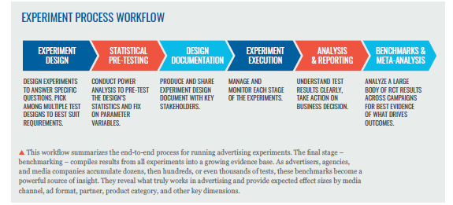](./tables/Table_Image_1_Experiment_Process_Workflow.png)

### Table 2: Rolling Thunder Multi-Armed Stepped CRT
[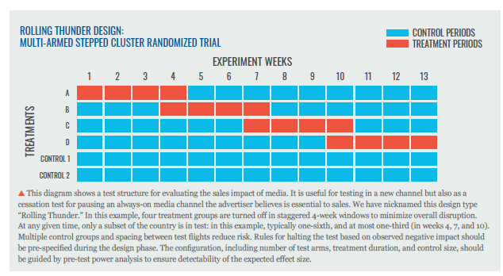](./tables/Table_Image_2_Rolling_Thunder_Multi_Armed_Stepped_CRT.png)

### Table 3: Example Multi-Armed Geographic RCE All DMAs
[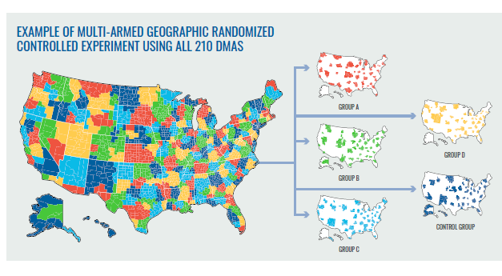](./tables/Table_Image_3_Example_Multi_Armed_Geographic_RCE_All_DMAs.png)

### Table 4: Weekly Sales Trend Across Two Years Seasonality
[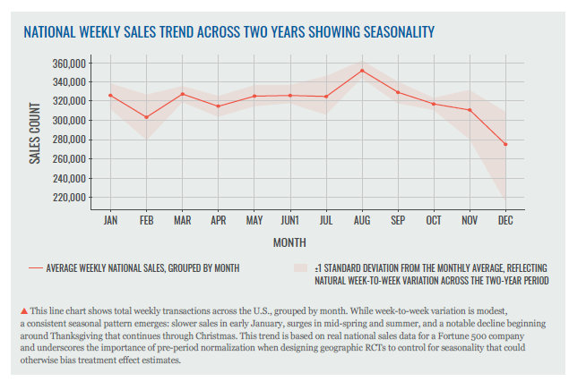](./tables/Table_Image_4_Weekly_Sales_Trend_Across_Two_Years_Seasonality.png)

### Table 5: Example Sales Data
[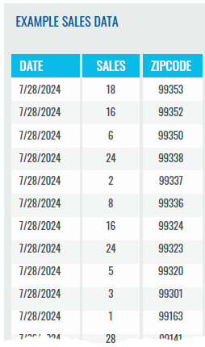](./tables/Table_Image_5_Example_Sales_Data.png)

### Table 6: Rolling Thunder Balance Check 6 Groups 4 Weeks
[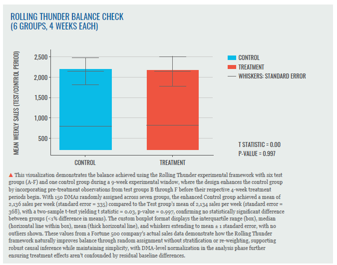](./tables/Table_Image_6_Rolling_Thunder_Balance_Check_6Groups_4Weeks.png)

### Table 7: Simulated Rolling Thunder 3% Lift
[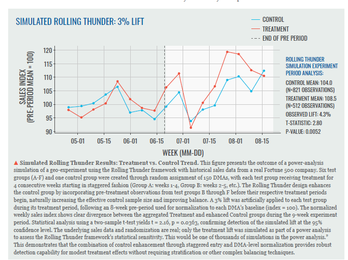](./tables/Table_Image_7_Simulated_Rolling_Thunder_3%Lift.png)

### Table 8: Raw Sales By DMA Normalized Sales Index By DMA
[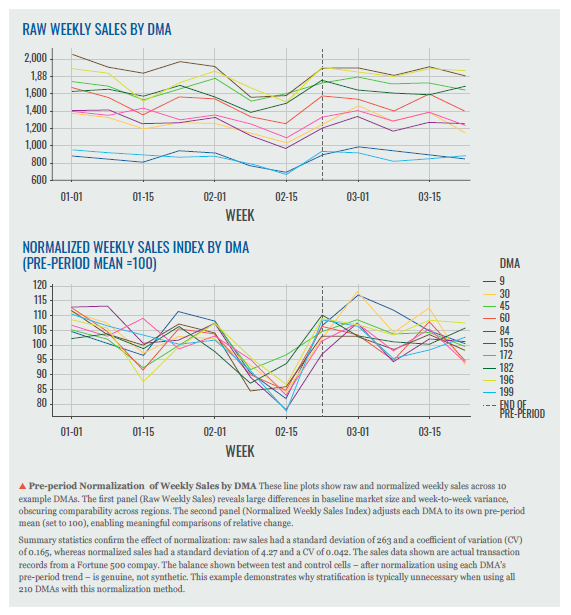](./tables/Table_Image_8_Raw_Sales_By_DMA_Normalized_Sales_Index_By_DMA.png)

### Table 9: Power Grid P-value Estimates For Multi-armed RT Test Various Effect Sizes
[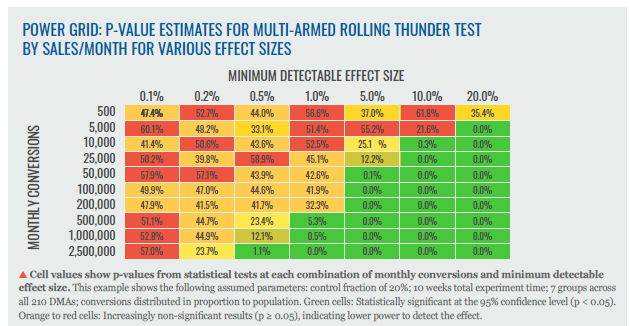](./tables/Table_Image_9_Power_Grid_Pvalue_Estimates_For_Multiarmed_RT_Test_Various_Effect_Sizes.png)

### Table 10: Example Randomized DMA List
[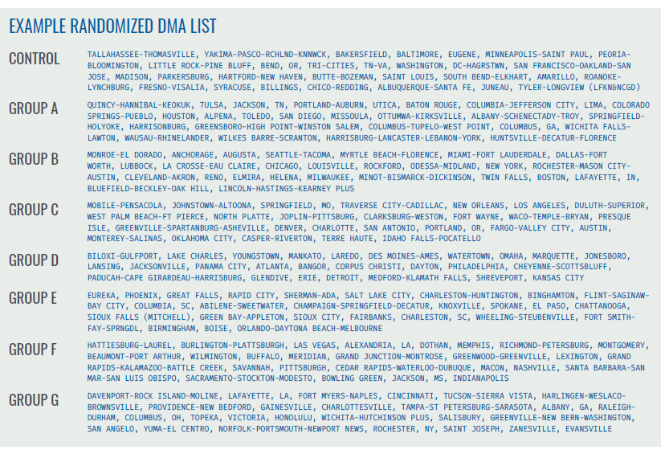](./tables/Table_Image_10_Example_Randomized_DMA_List.png)

### Table 11: Compliance Monitoring Metrics
[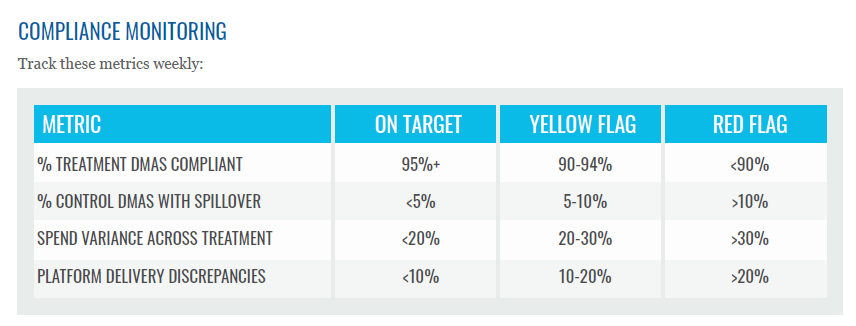](./tables/Table_Image_11_Compliance_Monitoring_Metrics.png)

### Table 12: Diagnostic Checks Simulated RCT Results
[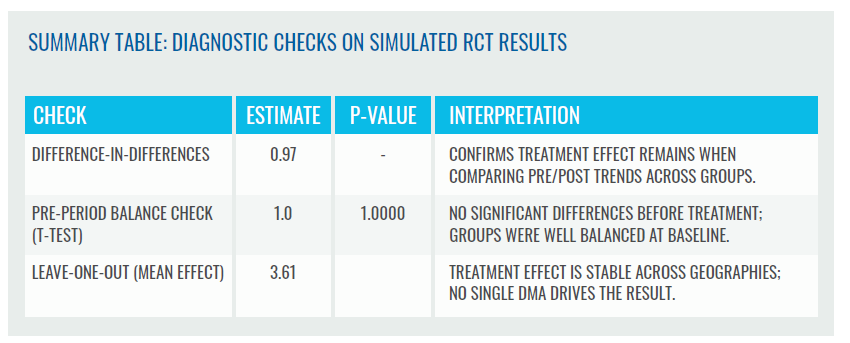](./tables/Table_Image_12_Diagnostic_Checks_Simulated_RCT_Results.png)

### Table 13: Decision Framework
[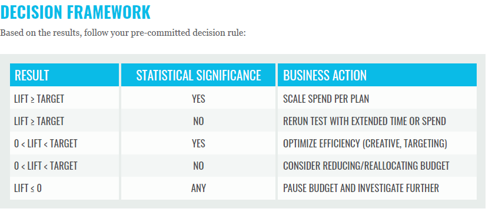](./tables/Table_Image_13_Decision_Framework.png)

### Table 14: Recalibrating Impact Response Curve In MMM
[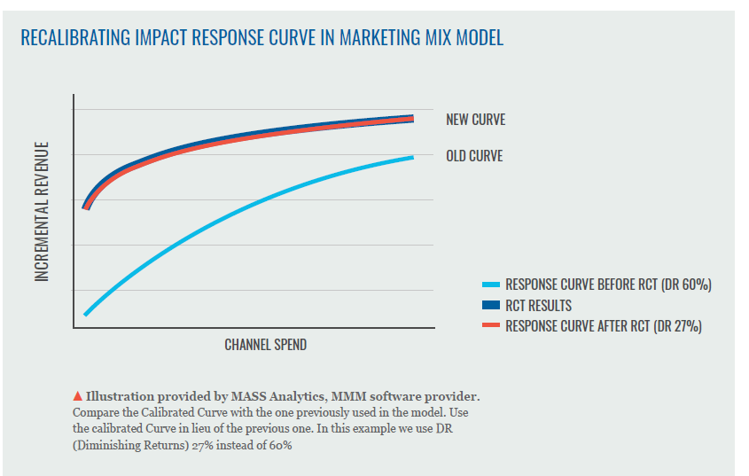](./tables/Table_Image_14_Recalibrating_Imact_Response_Curve_In_MMM.png)

## License
Unless otherwise noted, this repository is released under **CC BY 4.0**.

